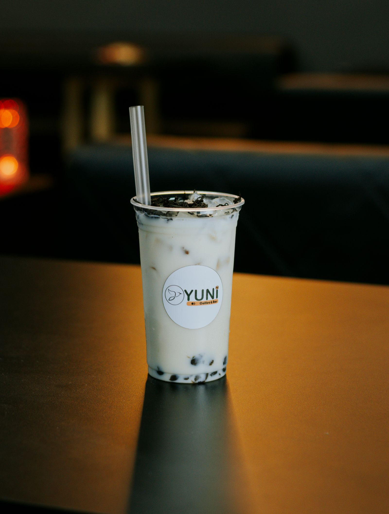

# 🧋 Bingyu 冰语 — Boba • Ice Cream • Coffee • Online Ordering & Cart

<p align="center">
  
</p>

<p align="center">
  <strong>Sri Lanka's high-energy dessert & drinks corner-shop web platform</strong><br />
  <em>Photogenic boba, cloud-soft sundaes, refreshing fruit teas, and late-night coffee with interactive ordering.</em>
</p>

<p align="center">
  <a href="#-key-features">Features</a> •
  <a href="#-tech-stack">Tech Stack</a> •
  <a href="#-menu--offerings">Menu</a> •
  <a href="#-ordering--customization">Ordering System</a> •
  <a href="#-project-structure">Project Structure</a> •
  <a href="#-getting-started">Getting Started</a> •
  <a href="#-promo-codes">Promo Codes</a>
</p>

---

## ✨ Overview

**Bingyu 冰语** is a modern, responsive web application and e-commerce experience designed for a youth lifestyle beverage & dessert brand in Sri Lanka. Featuring custom vector branding (featuring the beloved mascot **冰语猫 · Bingyu Cat**), a vibrant aesthetic (活力红 Energy Red & Warm Wood), and a snappy ordering workflow with WhatsApp integration and persistent cart state.

---

## 🚀 Key Features

### 🧋 1. Interactive Menu & Real-Time Search
- **Live Keyword Search**: Instant searching across all boba, sundaes, fruit teas, and coffees with result counts and clear controls.
- **Category Filtering**: Fast pill filters for *Boba Tea*, *Sundaes & Cones*, *Fruit Teas*, and *Coffee*.
- **Quick-Add & Full Customization**: One-click quick add or deep customization per product.

### ⚙️ 2. Comprehensive Drink & Dessert Customizer Modal
- **Cup Size Selection**: Regular (500ml) or Large (700ml 🥤).
- **Sugar / Sweetness Levels**: 100% (Standard), 70% (Less Sweet), 50% (Half Sweet), 0% (No Sugar).
- **Ice Levels**: Regular Ice 🧊, Less Ice ❄️, No Ice 🚫, Warm / Hot 🔥.
- **Extra Toppings**: Tapioca Pearls, Popping Boba, Coconut Jelly, Cheese Foam Layer, and Egg Pudding.
- **Special Instructions**: Customer notes for the kitchen baristas.

### 🛍️ 3. Sliding Shopping Bag & Cart Engine
- **Persistent State**: Full `localStorage` support ensures bag contents survive page reloads.
- **Free Delivery Meter**: Dynamic progress bar toward the Rs. 1,500 Colombo Free Delivery threshold.
- **Discount & Promo System**: Real-time validation of coupon codes.
- **Floating Cart Button & Badges**: Always accessible across desktop and mobile screens.

### 🚀 4. Seamless Dual-Fulfillment Checkout
- **Delivery or Store Pickup**: Supports Colombo home delivery or pickup at Nugegoda Flagship, Kollupitiya Night Owl, or Galle Coastal branches.
- **Direct Order Submission**: Instant digital receipt generation with Order ID, customer details, and preparation status.
- **Order via WhatsApp**: Generates a pre-formatted, itemized order message sent directly to the store WhatsApp hotline.

### 🎨 5. Signature Brand Identity & Visual Design
- **Custom Mascot (冰语猫)**: High-resolution inline SVG graphics with smooth animations.
- **Rich Aesthetic**: Styled with Google Fonts (*Baloo 2* & *Nunito*), smooth marquee tickers, glassmorphism, floating badge stickers, and scroll reveal animations.
- **Zero Heavy Framework Overhead**: Built with clean, pure Vanilla HTML5, CSS3, and JavaScript for maximum speed and performance.

---

## 🛠️ Tech Stack

| Layer | Technology |
| :--- | :--- |
| **Frontend Markup** | Semantic HTML5, Embedded SVG Sprite Sheets |
| **Styling & Design** | Vanilla CSS3 (Custom Design System, CSS Variables, Flexbox/Grid, Animations) |
| **Interactivity & State** | Vanilla JavaScript (ES6+, DOM Manipulation, LocalStorage API) |
| **Typography** | [Baloo 2](https://fonts.google.com/specimen/Baloo+2) & [Nunito](https://fonts.google.com/specimen/Nunito) |
| **Asset Imagery** | Curated high-resolution photography (`assets/images/`) |

---

## 🍨 Menu & Offerings

| Category | Signature Items | Base Price (LKR) |
| :--- | :--- | :--- |
| **🧋 Boba Tea** | Classic Pearl Milk Tea, Brown Sugar Boba, Taro Cloud Milk Tea | Rs. 350 – Rs. 480 |
| **🍨 Sundaes & Cones** | Sea-Salt Soft Cone, Blueberry Cloud Sundae, Strawberry Snow Sundae | Rs. 250 – Rs. 550 |
| **💙 Fruit Teas** | Pineapple Ice Blue Tea, Berry-Citrus Iced Tea, Sunrise Lemon Black Tea | Rs. 400 – Rs. 450 |
| **☕ Coffee** | Iced Vietnamese Latte, Sea-Salt Caramel Frappé | Rs. 550 – Rs. 600 |

---

## 🎟️ Active Promo Codes

Try these demo coupon codes in the shopping bag:

| Code | Benefit |
| :--- | :--- |
| `BINGYU10` | 10% Discount on subtotal |
| `FREESHIP` | 100% Free Delivery waiver |
| `CATLOVER` | Rs. 100 Flat Discount |

---

## 📂 Project Structure

```text
bingyu-website/
├── index.html              # Main HTML landing page, modals, and SVG defs
├── css/
│   └── styles.css          # Core design tokens, layout, and responsive CSS
├── js/
│   └── main.js             # Cart logic, customizer, live search, WhatsApp checkout
├── assets/
│   └── images/             # Product photography & brand assets
│       ├── hero-bubbletea.jpg
│       ├── boba-sunny.jpg
│       ├── milktea-pink.jpg
│       ├── cone-sky.jpg
│       ├── icecream-cup.jpg
│       ├── sundae-strawberry.jpg
│       ├── blue-ice-soda.jpg
│       ├── icedtea-hibiscus.jpg
│       ├── icedtea-lemon.jpg
│       ├── coffee-iced.jpg
│       ├── coffee-row.jpg
│       └── shop-interior.jpg
└── README.md               # Project documentation
```

---

## 🏁 Getting Started

### 1. Clone the repository
```bash
git clone https://github.com/epunmanula/bingyu-web.git
cd bingyu-web
```

### 2. Run locally
Since this is a lightweight static web app, you can open `index.html` directly in any modern browser or use a live server:

```bash
# Using VS Code Live Server or Python:
python -m http.server 3000

# Using Node / npx:
npx serve .
```

Visit `http://localhost:3000` to view the website.

---

## 📍 Store Locations

- **Nugegoda Flagship**: Campus crowd favorite, full snack shelves & photo walls *(Open daily 10:00 – 23:00)*
- **Kollupitiya Night Owl**: Late night dessert runs & late coffees *(Open daily till 1:30 AM)*
- **Galle Fort Coastal**: Seaside chilled sips & scoops *(Open daily 10:00 – 22:00)*
- **Bambalapitiya**: *Opening Soon!*

---

## 📄 License

This project is created for **Bingyu 冰语 Sri Lanka**. All rights reserved © 2026.
